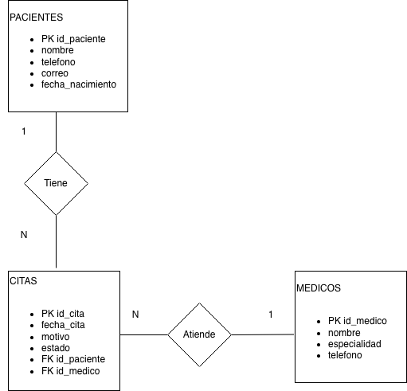

# Arquitectura Final - Sistema de Control de Citas Médicas

## 1. Estrategia y Alcance

### Contexto del Negocio

Muchas clínicas pequeñas continúan gestionando sus citas médicas mediante agendas físicas o registros manuales. Este método puede generar errores de programación, pérdida de información y duplicidad de citas. Para resolver esta problemática se propone el desarrollo de un Sistema de Control de Citas Médicas que permita administrar de forma digital el registro de pacientes, médicos y citas.

### Objetivo General del MVP

Desarrollar un sistema web que permita registrar pacientes, registrar médicos, programar citas y consultar información relacionada con las mismas. El Producto Mínimo Viable (MVP) demostrará la funcionalidad básica necesaria para administrar citas médicas de manera eficiente.

### Requerimientos Funcionales

* Registrar pacientes.
* Registrar médicos.
* Programar citas.
* Consultar citas.

### Requerimientos No Funcionales

* Seguridad.
* Disponibilidad.
* Rendimiento.
* Mantenibilidad.

### Atributos de Calidad Prioritarios

#### Seguridad

La seguridad es uno de los atributos de calidad más importantes del sistema debido a que almacena información personal de pacientes y médicos. El sistema debe garantizar que únicamente usuarios autorizados puedan acceder a la información.

Escenario de Calidad

Estímulo: Un usuario intenta acceder a la información de citas médicas sin credenciales válidas.

Respuesta: El sistema rechaza el acceso, registra el intento en un archivo de auditoría y muestra un mensaje de autenticación fallida.

Métrica: El 100% de los intentos de acceso no autorizados deben ser bloqueados y registrados.


#### Disponibilidad

##### Definición e Impacto

El sistema debe permanecer disponible para que las citas puedan registrarse y consultarse durante el horario de operación de la clínica.

##### Escenario de Arquitectura

Si la base de datos MySQL pierde conexión durante 10 minutos, el sistema mostrará un mensaje de indisponibilidad temporal y evitará operaciones que puedan comprometer la integridad de los datos hasta restablecer la conexión.

#### Rendimiento

##### Definición e Impacto

Las consultas y registros de citas deben ejecutarse rápidamente para evitar retrasos en la atención de los usuarios.

##### Escenario de Arquitectura

Una búsqueda de citas por paciente deberá responder en pocos segundos aun cuando existan cientos de registros almacenados.

#### Mantenibilidad

##### Definición e Impacto

El sistema debe permitir realizar modificaciones, correcciones y nuevas funcionalidades sin afectar significativamente el funcionamiento existente.

##### Escenario de Arquitectura

La incorporación futura de módulos como expedientes clínicos o reportes médicos deberá requerir cambios mínimos en las capas existentes gracias a la separación de responsabilidades implementada en la arquitectura.


---

## 2. Vista Estructural (C4)

### Diagrama de Contexto


### Diagrama de Contenedores

 


### Diccionario de Contenedores

| Contenedor | Tecnología | Responsabilidad Principal | Despliegue |
|------------|------------|--------------------------|------------|
| Frontend | React + TypeScript | Interfaz de usuario para gestión de citas médicas, captura de datos y consulta de información. | localhost:3000 |
| Backend API | Java 17 + Spring Boot | Procesar la lógica de negocio, validar información y gestionar las operaciones relacionadas con pacientes, médicos y citas. | localhost:8080 |
| Base de Datos | MySQL 8.0 | Almacenar de forma persistente la información de pacientes, médicos y citas médicas. | localhost:3306 |


### Análisis de Fallos

Si el contenedor de Base de Datos pierde conexión durante 10 minutos, el Backend API no podrá consultar ni almacenar información de las citas médicas. El Frontend continuará funcionando, permitiendo la navegación del usuario, pero las operaciones que requieran acceso a datos no podrán completarse.

El usuario será informado mediante mensajes visuales indicando que el servicio se encuentra temporalmente no disponible y que debe intentar nuevamente más tarde.

Como estrategia de tolerancia a fallos, el sistema implementará manejo de excepciones y respuestas controladas desde el Backend para evitar errores inesperados o el colapso total de la aplicación. De esta manera, el Frontend podrá mostrar mensajes claros sin interrumpir completamente la experiencia del usuario.

---

## 3. Vista de Fronteras y Contratos

### Flujo Crítico 1: Registro de Cita

#### Request

```json
{
  "idPaciente": 1,
  "idMedico": 2,
  "fechaCita": "2026-07-15 10:00",
  "motivo": "Consulta General"
}
```

#### Response

```json
{
  "idCita": 25,
  "estado": "PROGRAMADA",
  "mensaje": "Cita registrada correctamente"
}
```

### Flujo Crítico 2: Consulta de Citas

#### Request

```json
{
  "idPaciente": 1
}
```

#### Response

```json 
{
  "citas": [
    {
      "idCita": 25,
      "fechaCita": "2026-07-15 10:00",
      "estado": "PROGRAMADA"
    }
  ]
}
```


### Manejo de Caja Rota

Si la base de datos pierde conexión, el Backend devolverá una respuesta controlada:

```json
{
  "errorCodigo": "DB-OFFLINE",
  "mensaje": "Servicio temporalmente no disponible. Intente nuevamente más tarde."
}
```


### Stacktrace y Resiliencia

Los errores internos serán registrados en los archivos de log del sistema. El stacktrace nunca será mostrado al usuario final para evitar la exposición de información sensible sobre la infraestructura o la implementación interna de la aplicación.

---

## 4. Vista de Persistencia (DER)

### Diagrama Entidad Relación



### Descripción del DER

El modelo de datos está compuesto por las entidades Pacientes, Médicos y Citas. Un paciente puede tener múltiples citas y un médico puede atender múltiples citas. La entidad Citas funciona como la tabla central del sistema y relaciona pacientes y médicos mediante llaves foráneas, garantizando la integridad referencial de la información.

### Diccionario de Datos

## Sistema de Control de Citas Médicas

### Tabla: Pacientes

| Campo            | Tipo de Dato | Llave | Descripción                      |
| ---------------- | ------------ | ----- | -------------------------------- |
| id_paciente      | INT          | PK    | Identificador único del paciente |
| nombre           | VARCHAR(100) |       | Nombre completo del paciente     |
| telefono         | VARCHAR(15)  |       | Número telefónico                |
| correo           | VARCHAR(100) |       | Correo electrónico               |
| fecha_nacimiento | DATE         |       | Fecha de nacimiento              |

---

### Tabla: Medicos

| Campo        | Tipo de Dato | Llave | Descripción                    |
| ------------ | ------------ | ----- | ------------------------------ |
| id_medico    | INT          | PK    | Identificador único del médico |
| nombre       | VARCHAR(100) |       | Nombre completo del médico     |
| especialidad | VARCHAR(100) |       | Especialidad médica            |
| telefono     | VARCHAR(15)  |       | Número de contacto             |

---

### Tabla: Citas

| Campo       | Tipo de Dato | Llave | Descripción                    |
| ----------- | ------------ | ----- | ------------------------------ |
| id_cita     | INT          | PK    | Identificador único de la cita |
| fecha_cita  | DATETIME     |       | Fecha y hora de la cita        |
| motivo      | VARCHAR(200) |       | Motivo de consulta             |
| estado      | VARCHAR(20)  |       | Estado de la cita              |
| id_paciente | INT          | FK    | Referencia al paciente         |
| id_medico   | INT          | FK    | Referencia al médico           |

---

## Relaciones

* Un paciente puede tener muchas citas.
* Un médico puede atender muchas citas.
* Una cita pertenece a un único paciente.
* Una cita pertenece a un único médico.


---

## 5. Vista de Despliegue e Infraestructura

### Tipo de Despliegue

Despliegue Local.

### Justificación

Se selecciona un entorno local porque simplifica el desarrollo del MVP, reduce costos y facilita las pruebas durante la etapa académica.

### Infraestructura

Frontend React → localhost:3000

Backend Spring Boot → localhost:8080

MySQL → localhost:3306

## Conclusión

La arquitectura propuesta para el Sistema de Control de Citas Médicas proporciona una solución organizada y escalable para la gestión de pacientes, médicos y citas. La combinación de una arquitectura cliente-servidor, un modelo en capas y una base de datos relacional permite satisfacer los requerimientos funcionales y no funcionales del MVP, garantizando seguridad, disponibilidad, rendimiento y facilidad de mantenimiento.
