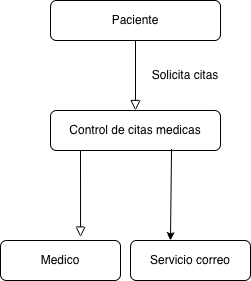
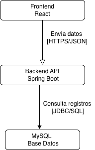

# Tarea 3 - Modelo C4

## Nivel 1 - Diagrama de Contexto

## Nivel 2 - Diagrama de Contenedores

## Análisis de Fallos

Si el contenedor de Base de Datos pierde conexión durante 10 minutos, el Backend API no podrá consultar ni almacenar información de las citas médicas. El Frontend continuará funcionando, permitiendo la navegación del usuario, pero las operaciones que requieran acceso a datos no podrán completarse.

El usuario será informado mediante mensajes visuales indicando que el servicio se encuentra temporalmente no disponible y que debe intentar nuevamente más tarde.

Como estrategia de tolerancia a fallos, el sistema implementará manejo de excepciones y respuestas controladas desde el Backend para evitar errores inesperados o el colapso total de la aplicación. De esta manera, el Frontend podrá mostrar mensajes claros sin interrumpir completamente la experiencia del usuario.

## Diccionario de Contenedores

| Contenedor    | Tecnología            | Responsabilidad Principal                                               | Despliegue Local |
| ------------- | --------------------- | ----------------------------------------------------------------------- | ---------------- |
| Frontend      | React + TypeScript    | Mostrar formularios, capturar datos y presentar información al usuario. | localhost:3000   |
| Backend API   | Java 17 + Spring Boot | Procesar reglas de negocio, validar información y gestionar citas.      | localhost:8080   |
| Base de Datos | MySQL 8.0             | Almacenar información de pacientes, médicos y citas.                    | Puerto 3306      |

